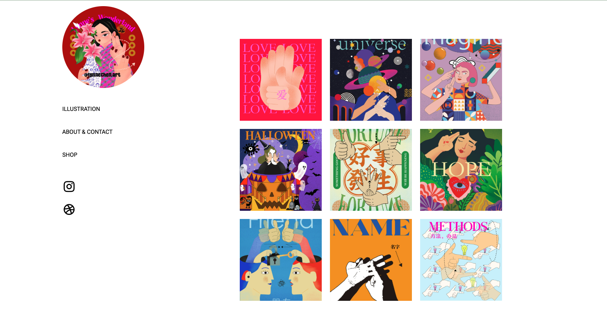
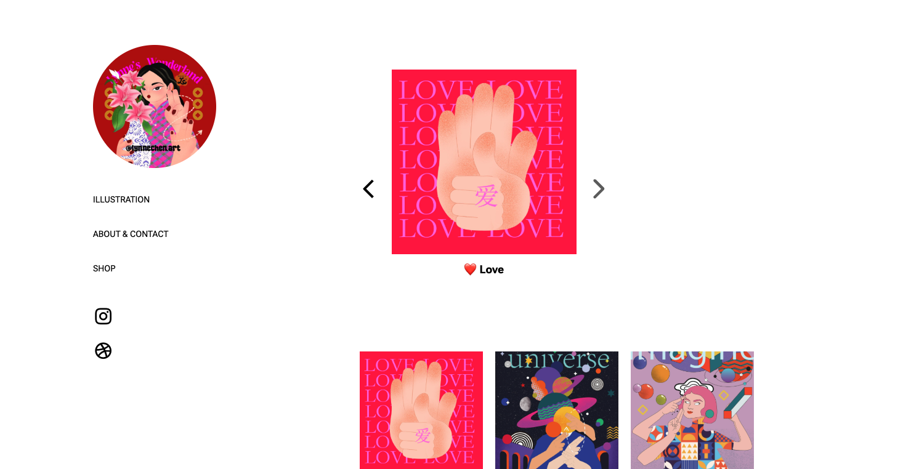
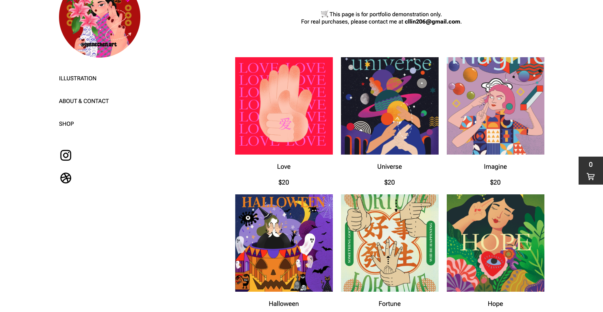
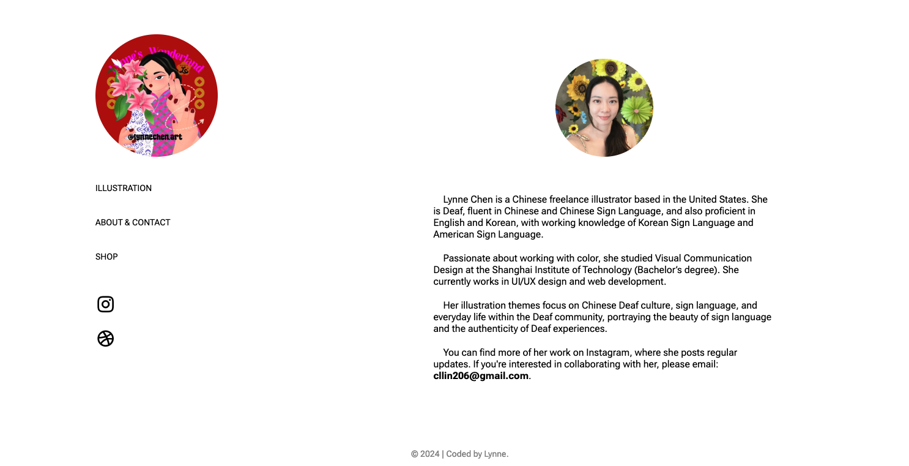
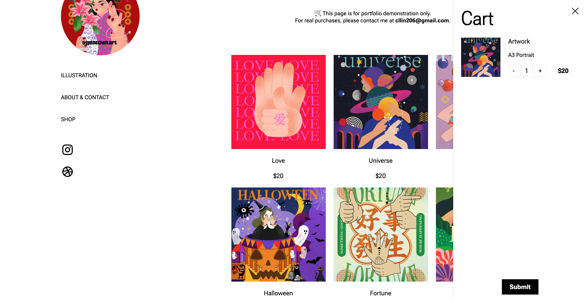
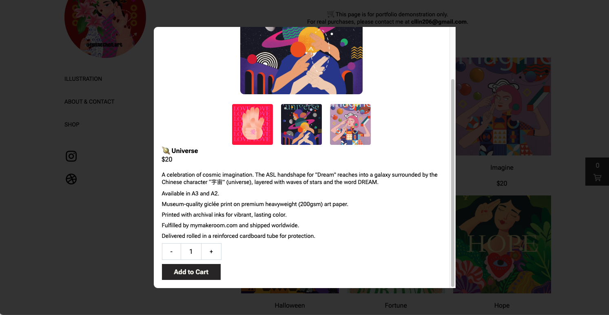

# 🎨 Lynne’s Illustration Portfolio

🚀 [Live Demo](https://lynnec88.github.io/illustration-portfoliio/)

一个展示插画作品的响应式个人作品网站。用户可以浏览作品、查看详情，并进入商店页面。

A responsive personal portfolio site for showcasing illustration works. Users can browse artworks, view details, and access the shop page.

---

## 🧩 Project Overview | 项目简介

**功能模块 Features:**

- 🖼️ **Homepage / 首页** (`index.html`)  
  Displays illustration works with zoom-in modal and detailed descriptions.  
  插画作品展示区，点击图片可放大预览并查看说明。

- 👤 **About & Contact / 关于与联系**  
  Dynamically loads about information within the main page.  
  点击导航中 "ABOUT & CONTACT" 后在本页加载介绍内容。

- 🛍️ **Shop Page / 商店页** (`shop.html`)  
  A mock store interface that allows:
  - Clicking images to preview
  - Adjusting quantities
  - Adding items to a cart
  - Simulated checkout  
  模拟电商购物界面，可点击查看大图、调整数量并加入购物车。

---

## 🛠 Tech Stack | 技术栈

- HTML / CSS / 原生 JavaScript
- Google Fonts: [Roboto Flex](https://fonts.google.com/specimen/Roboto+Flex)
- 图标库: [RemixIcon](https://remixicon.com/)

---

## 📁 Directory Structure | 项目结构
illustration-portfoliio/
├── css/ # 样式文件
│ ├── common.css
│ ├── shop.css
├── image/ # 图片资源
│ ├── 1.jpg ~ 12.jpg
│ └── icon.png
├── js/ # 脚本
│ ├── about.js
│ ├── shop.js
│ └── descriptions.js
├── index.html # 首页
├── shop.html # 商店页面
└── README.md # 本文件

## 📸 Screenshots | 页面截图

### 🏠 Homepage


### 🖼️ Artwork Viewer Modal
Click on a work from the homepage to view its details in a modal with left-right image navigation.



### 🛍️ Shop Page


### 👤 About Section


### 🛒 Cart Popup


### 🖼️ Image Overlay


## 🧪 Run Locally | 本地运行

```bash
git clone https://github.com/lynnec88/illustration-portfoliio.git
cd illustration-portfoliio
打开 index.html 或 shop.html 即可在浏览器查看。


🧑‍🎨 About the Artist | 关于插画师
👩‍🎨 Illustrator & Web Developer: Lynne Chen

🌐 Instagram @lynnechen.art

🎨 Dribbble @lynnechen1

📩 Email: cllin206@gmail.com

📄 License | 版权说明
此项目仅用于作品展示与 UI 模拟，非商业用途。
This project is for portfolio and demonstration purposes only.

© 2024-2025 | Coded by Lynne Chen

